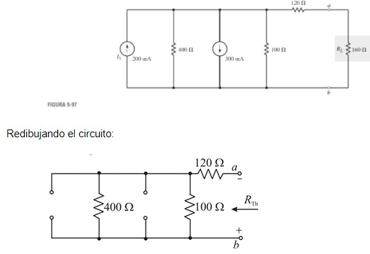

# Informe Tarea N°5
**Integrantes:**

Christian Bonifaz, Mateo Calderon, Josue Camacho, Luis Guevara

**NRC:** 5415

**Docente:** Ing. Darwin Alulema

**Tema:** Capitulo 9 (Teoremas de redes) y capitulo 10 (Capacitores y capacitancia) de Análisis de Circuitos - Robbins, Miller

### 1. OBJETIVOS

- Emplear los Teoremas de Redes y los conceptos de Capacitores,Capacitancia para la resolucion de ejercicios de circuitos eléctricos.

### 2. MARCO TEÓRICO

#### Capitulo 9 (Teoremas de redes)

#### Capitulo 10 (Capacitores y capacitancia) 

### 3. EXPLICACIÓN Y RESOLUCIÓN DE EJERCICIOS O PROBLEMAS

#### Capitulo 9 (Teoremas de redes)

15.Vea el circuito de la figura 9-89:

17.Vea el circuito de la figura 9-91:

19.Repita el problema 17 para el circuito de la figura 9-93.

21.Encuentre el circuito equivalente de Thévenin de la red externa a las ramas que se indican, como se muestra en la figura 9-95.

23.Repita el problema 22 para el circuito de la figura 9-97.

25.Encuentre el circuito equivalente de Norton externo a RL en el circuito de la figura 9-81. Use el circuito equivalente para encontrar IL para el circuito.

27.Repita el problema 25 para el circuito de la figura 9-83.

#### Capitulo 10 (Capacitores y capacitancia) 

### 4. VIDEO

### 5. CONCLUSIONES 

### 6. BIBLIOGRAFÍA

Robbins, A., & Miller, W. (2008). Análisis de circuitos. Estados Unidos: Cengage Learning.
