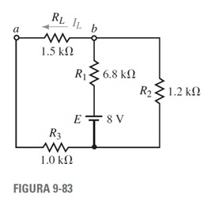
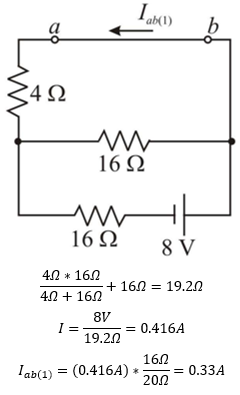
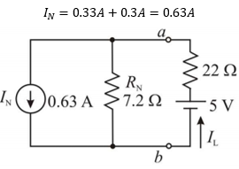
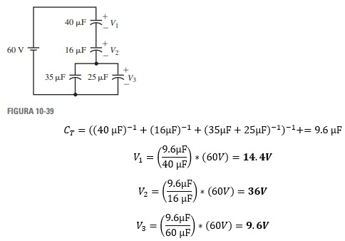
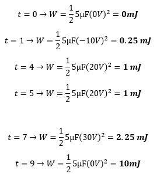

# Informe Tarea N°5
**Integrantes:**

Christian Bonifaz, Mateo Calderon, Josue Camacho, Luis Guevara

**NRC:** 5415

**Docente:** Ing. Darwin Alulema

**Tema:** Capitulo 9 (Teoremas de redes) y capitulo 10 (Capacitores y capacitancia) de Análisis de Circuitos - Robbins, Miller

### 1. OBJETIVOS

- Emplear los Teoremas de Redes y los conceptos de Capacitores,Capacitancia para la resolucion de ejercicios de circuitos eléctricos.

- Analizar y desarrollar los diferentes ejercicios aplicando los conceptos aprendidos sobre los teoremas de redes, y sobre capacitores y capacitancia, afinando así nuestro conocimiento y destreza al momento de resolver los mismos. 

### 2. MARCO TEÓRICO

#### Capitulo 9 (Teoremas de redes)

#### Capitulo 10 (Capacitores y capacitancia) 

### 3. EXPLICACIÓN Y RESOLUCIÓN DE EJERCICIOS O PROBLEMAS

#### Capitulo 9 (Teoremas de redes)

**1. Dado el circuito de la figura 9-75, use la superposición para calcular la corriente a través de cada uno de los resistores.**

**3. Use la superposición para encontrar el voltaje Va y la corriente I en el circuito de la figura 9-77.**

**5. En el circuito de la figura 9-79, ¿cuál debe ser el valor de la fuente de voltaje desconocida para asegurar que la corriente a través de la carga sea IL=5 mA, tal y como se muestra? Verifique los resultados mediante la superposición.**

**7. Encuentre el equivalente de Thévenin externo a RL en el circuito de la figura 9-81. Use el circuito equivalente para encontrar Vab.**

**9. Repita el problema 7 para el circuito de la figura 9-83.**

**11. Vea el circuito de la figura 9-85:**

**a. Encuentre el circuito equivalente de Thévenin externo a RL.**

**b. Use el circuito equivalente para determinar Vab cuando RL=20Ω y cuando RL=50Ω.**

**13. Vea el circuito de la figura 9-87:**

**a. Encuentre el circuito equivalente de Thévenin externo a las terminales indicadas.**

**b. Use el circuito equivalente de Thévenin para determinar la corriente a través de las ramas indicadas.**

15.Vea el circuito de la figura 9-89:

17.Vea el circuito de la figura 9-91:

19.Repita el problema 17 para el circuito de la figura 9-93.

21.Encuentre el circuito equivalente de Thévenin de la red externa a las ramas que se indican, como se muestra en la figura 9-95.

23.Repita el problema 22 para el circuito de la figura 9-97.

25.Encuentre el circuito equivalente de Norton externo a RL en el circuito de la figura 9-81. Use el circuito equivalente para encontrar IL para el circuito.

27.Repita el problema 25 para el circuito de la figura 9-83.

**29. Vea el circuito de la figura 9-85**

a. Encuentre el circuito equivalente de Norton externo a RL.

RN=0Ω+16Ω=16Ω

b. Use el circuito equivalente para determinar IL cuando RL  20 kohm y cuando RL  50 kohm

**31. a. Encuentre el circuito equivalente de Norton externo a las terminales que se
indican en la figura 9-87**

b. Convierta el circuito equivalente de Thévenin del problema 13 en su equivalente de Norton.

**33. Repita el problema 31 para el circuito de la figura 9-91**

a. Encuentre el circuito equivalente de Norton externo a las terminales que se
indican en la figura 9-91

b. Convierta el circuito equivalente de Thévenin en su equivalente de Norton.

**35. Repita el problema 31 para el circuito de la figura 9-95**

a. Encuentre el circuito equivalente de Norton externo a las terminales que se
indican en la figura 9-95

b. Convierta el circuito equivalente de Thévenin en su equivalente de Norton.

**37. a. Para el circuito de la figura 9-91 determine el valor de RL para que se suministre la máxima potencia a la carga.**

b. Calcule el valor de la máxima potencia que puede ser suministrada a la
carga.

c. Dibuje la curva de potencia contra resistencia cuando RL se ajusta de 0 ohm a
50 kohm en incrementos de 5 kohm.

**39. a. Para el circuito de la figura 9-99 encuentre el valor de R de manera que
RL=RTh**

b. Calcule la máxima potencia disipada por RL.

**41. a. Para el circuito de la figura 9-101 determine los valores de R1 y R2 de manera que la carga de 32 kohm reciba la máxima potencia.**

b. Calcule la máxima potencia suministrada por RL.

**43. Si la porción indicada del circuito de la figura 9-102 se reemplaza con una fuente de voltaje y un resistor en serie de 50 ohm, determine la magnitud y polaridad de la fuente de voltaje resultante.**

**45. Use el Teorema de Millman para encontrar la corriente y la potencia disipada por RL en el circuito de la figura 9-103.**

**47. Repita el problema 45 para el circuito de la figura 9-105.**

**49. a. Determine la corriente I en el circuito de la figura 9-107. b. Demuestre que la reciprocidad se aplica en el circuito dado.**

**51. a. Determine el voltaje V en el circuito de la figura 9-109. b. Demuestre que la reciprocidad se aplica en el circuito dado.**

#### Capitulo 10 (Capacitores y capacitancia) 

**13. 	a. ¿Cuál es la intensidad del campo eléctrico E a una distancia de 1 cm de una carga de 100 mC en aceite?
b. ¿Cuál es E al doble de la distancia?**

**15. Un capacitor con aire como dieléctrico tiene un espaciamiento de placas de 1.5 mm. ¿Cuánto voltaje se le puede aplicar antes de que ocurra una ruptura?**

**17. Un capacitor con un dieléctrico de mica sufre una ruptura cuando se le aplican E volts. La mica se remueve y el espacio entre las placas se duplica. Si la ruptura ahora ocurre a 500 V, ¿cuál es el valor de E?**

**19. La figura 10-32 muestra varios espaciamientos, entre ellos se incluye un capacitor de placas paralelas, un conjunto de pequeños puntos esféricos y un par de puntos afilados. Todos los espaciamientos miden lo mismo. Conforme el voltaje se incrementa, ¿qué espaciamiento sufre ruptura en cada caso?**

**23. ¿Cuál es la capacitancia equivalente de 10, 12, 22 y 33 µF conectados en paralelo?**

**25. Repita el problema 23 si los capacitores están conectados en serie.**

**27. Determine CT para cada uno de los circuitos de la figura 10-33.**

**29. Un capacitor de 30 F se conecta en paralelo con un capacitor de 60 F, y otro de 10 F se conecta en serie con la combinación en paralelo. ¿Cuál es el valor de CT?**

**31. Para la figura 10-36, determine C3 y C4.**

**33. Se tienen capacitores de 22, 47, 2.2 y 10 uF. ¿Cuál es la capacitancia equivalente más grande que se puede obtener conectándolos de la manera que usted prefiera?, ¿y la más pequeña?**

**35.  Considere capacitores de 1, 1.5 y 10 uF. Si CT = 10-6 uF, ¿cómo están conectados los capacitores?**

El capacitor de 10 uF está en paralelo con la combinación en serie de los capacitores de 1 uF y 1.5 uF 

**37. Para las figuras 10-33 (c) y (d), encuentre el voltaje en cada capacitor si se aplican 100 V en las terminales a-b**

**39.Repita el problema 38 para el circuito de la figura 10-39.**

**41.Para la figura 10-41, determine Cx.**

**43.El voltaje en el capacitor de la figura 10-42(a) se muestra en (b). Dibuje la corriente ic a escala con valores numérico.**

**45.Si el voltaje en un capacitor de 4.7 µF es vc = 100e∧(-0.05t) V, ¿qué valor tiene ic?**

**47.Para la figura 10-42 determine la energía del capacitor en cada uno de los siguientes tiempos: t = 0, 1, 4, 5, 7 y 9 ms.**

### 4. VIDEO

[Problemas Capítulos 9 y 10 - Informe Tarea N°5](https://youtu.be/GZIR0naof0o "Problemas Capítulos 9 y 10 - Informe Tarea N°5")

### 5. CONCLUSIONES 

- Los Teoremas de Thevenin y Norton son muy útiles debido a que funciona para determinar intensidades y/o voltajes en circuitos que son muy complejos y grandes sin necesidad de desarrollar todo el circuito sino más bien, utilizando una corriente de cortocircuito, y el circuito equivalente, de esta manera se miden voltajes e intensidades especificas en un circuito complejo.

- Se puede concluir que mediante distintos tipos de ejercicios propuestos sea por los Teoremas de Redes y los conceptos de Capacitores,Capacitancia que lo aprendidio en clases se ha clarificado.

### 6. BIBLIOGRAFÍA

Robbins, A., & Miller, W. (2008). Análisis de circuitos. Estados Unidos: Cengage Learning.
